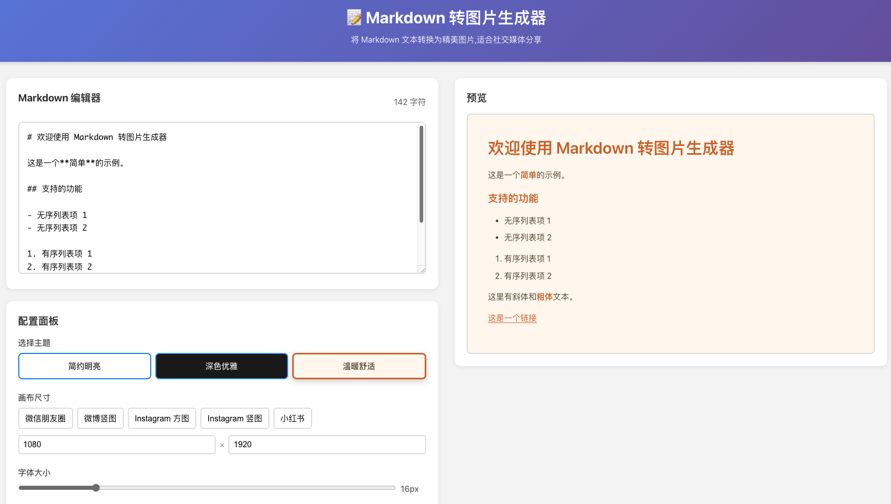

# 📝 Markdown 转图片生成器

一个在线 Web 应用,可以将 Markdown 文本转换为精美的高清图片,非常适合社交媒体内容分享。



## ✨ 功能特性

### 核心功能 (MVP)

- ✅ **Markdown 文本编辑** - 支持实时编辑和预览
- ✅ **支持的 Markdown 语法**:
  - H1-H6 标题
  - 无序列表 & 有序列表
  - 粗体 & 斜体
  - 引用 (Blockquote)
  - 链接 & 图片
  - **GFM 扩展**: 表格、任务列表、删除线、自动链接
  - **代码高亮**: 支持多种编程语言语法高亮
- ✅ **8 个预设主题**:
  - 包含 简约明亮、深色优雅、温暖舒适、森林气息、海洋之心、复古风格、午夜之魅、樱花物语
- ✅ **灵活配置**:
  - 画布尺寸自定义及 5 个社交媒体预设 (微信、微博、Instagram、小红书)
  - 字体大小调整
  - 颜色自定义 (背景、文字、强调色)
  - **渐变背景**: 支持自定义角度和起始颜色
  - 间距控制 (内边距、行间距、段落间距)
- ✅ **元信息** - 支持添加作者和时间信息，位置可选 (顶部/底部)
- ✅ **水印功能** - 支持自定义平铺水印内容、颜色、透明度及角度
- ✅ **高清图片生成** - 使用 2x DPI 确保清晰度
- ✅ **一键操作** - 支持下载图片到本地或直接复制到剪贴板

## 🎯 适用场景

- 📱 社交媒体内容创作 (微信朋友圈、微博、Instagram)
- 📝 笔记分享和知识传播
- 💡 个人想法和观点表达
- 🎨 文字排版和设计

## 🛠 技术栈

### 前端
- **React** - 用户界面框架
- **Vite** - 快速的开发构建工具
- **React-Markdown** - Markdown 渲染
- **html2canvas** - 纯前端图片生成

## 📦 安装和运行

### 前置要求

- Node.js 18+ 
- npm 或 yarn

### 安装步骤

1. **克隆仓库**

```bash
git clone https://github.com/slsefe/markdown-to-image-generator.git
cd markdown-to-image-generator
```

2. **安装依赖**

```bash
cd frontend
npm install
```

### 启动应用

#### 开发模式

1. **启动开发服务器**

```bash
npm run dev
```

前端应用将在 `http://localhost:5173` 运行

2. **访问应用**

在浏览器中打开 `http://localhost:5173`

## 📖 使用指南

### 基本使用流程

1. **输入内容** - 在左侧编辑器中输入或粘贴 Markdown 内容
2. **实时预览** - 右侧会实时显示渲染效果
3. **选择主题/自定义** - 从 8 个预设主题中选择，或手动调整背景、颜色、渐变和水印
4. **调整尺寸** - 选择社交媒体预设或手动输入宽高
5. **生成与分享** - 点击"下载图片"保存到本地，或点击"复制图片"直接在社交软件中粘贴

### 画布尺寸推荐

| 平台 | 推荐尺寸 | 比例 |
|------|---------|------|
| 微信朋友圈 | 1080 x 1260 | 6:7 |
| 微博竖图 | 1080 x 1920 | 9:16 |
| Instagram 方图 | 1080 x 1080 | 1:1 |
| Instagram 竖图 | 1080 x 1350 | 4:5 |
| 小红书 | 1080 x 1440 | 3:4 |

### 样式配置说明

- **字体大小**: 12-32px,默认 16px
- **内边距**: 20-80px,控制内容与边缘的距离
- **行间距**: 1.2-2.5,控制行与行之间的距离
- **段落间距**: 10-40px,控制段落之间的间隔

## 🎨 主题自定义

应用提供 3 个预设主题,也可以自定义颜色:

### 简约明亮
- 背景: 白色 (#FFFFFF)
- 文字: 深灰 (#333333)
- 强调: 蓝色 (#007AFF)

### 深色优雅
- 背景: 深黑 (#1a1a1a)
- 文字: 浅灰 (#E5E5E5)
- 强调: 亮蓝 (#4A9EFF)

### 温暖舒适
- 背景: 米黄 (#FFF8F0)
- 文字: 棕褐 (#5D4E37)
- 强调: 橙棕 (#D2691E)

## 📁 项目结构

```
markdown-to-image-generator/
├── frontend/                 # 前端应用
│   ├── src/
│   │   ├── App.jsx          # 主应用组件
│   │   ├── App.css          # 样式文件
│   │   ├── main.jsx         # 入口文件
│   │   └── index.css        # 全局样式
│   ├── package.json
│   └── vite.config.js
└── README.md                # 项目文档
```

## 🚀 部署

### 静态部署 (推荐)

由于本项目已实现纯前端图片生成，您可以将其部署到任何静态网站托管服务（如 Vercel, Netlify, GitHub Pages 等）：

1. **构建生产版本**

```bash
cd frontend
npm run build
```

2. **部署 dist 目录** 到托管平台。

## ⚠️ 注意事项

1. **内容限制**: 建议内容控制在 10000 字符以内
2. **浏览器支持**: 建议使用现代浏览器以获得最佳的图片生成效果
3. **本地存储**: 配置信息目前保存在内存中，刷新页面会重置

## 🗺 开发路线图

### 已完成 ✅
- [x] MVP 核心功能
- [x] 8 个预设主题
- [x] 渐变背景支持
- [x] 水印功能
- [x] 代码高亮支持
- [x] GFM 表格支持
- [x] 复制到剪贴板功能
- [x] 高清图片生成 (2x DPI)

### 计划中 🎯
- [ ] 更多预设主题 (20+)
- [ ] 历史记录 (本地存储)
- [ ] 配置模板保存
- [ ] 批量生成图片
- [ ] 数学公式支持 (LaTeX)
- [ ] Mermaid 图表支持
- [ ] 用户系统与云端同步

## 📄 许可证

MIT License

## 👥 贡献

欢迎提交 Issue 和 Pull Request!

## 📧 联系方式

如有问题或建议,请通过以下方式联系:

- 提交 Issue: [GitHub Issues](https://github.com/slsefe/markdown-to-image-generator/issues)
- 邮箱: baiyslsefe@gmail.com

---

**Made with ❤️ by Your Name**
